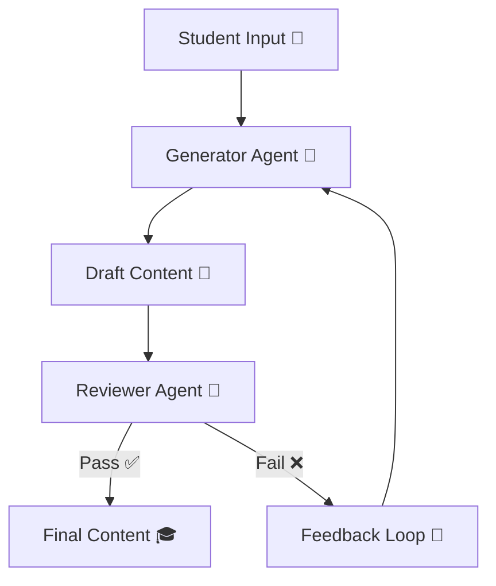

<h1 align="center">🎓 Eklavya AI Learning Engine</h1>
<h3 align="center">⚡ Autonomous Educational Content Generator & Reviewer</h3>

<p align="center">
  
  
  
  
</p>

---

## 🎥 System Demo (AI Teaching in Action)

<p align="center">
  
</p>

<p align="center">
  <b>📚 AI generates → evaluates → improves learning content in real-time</b>
</p>

---

## 🧠 What is Eklavya AI?

> A **self-evaluating AI teaching system** that creates and improves educational content.

```
📘 Topic Input → 🤖 AI Generates → 🧐 AI Reviews → 🔁 Refines → 🎯 Final Output
```

---

## ⚙️ Intelligent Agent Flow (Different Style)



---

## 🤖 Agents Breakdown  

| Agent | Responsibility |
|------|---------------|
| 🤖 Generator | Creates explanation + MCQs |
| 🧐 Reviewer | Evaluates quality & correctness |
| 🔁 Refinement | Improves based on feedback |

---

## ⚡ What Makes This Unique  

✨ Content is **not just generated — it is validated**  
✨ Ensures **age-appropriate learning**  
✨ Implements **self-improving AI loop**  
✨ Matches real-world **educational standards**  

---

## 🧪 Example Output  

```
📘 Explanation:
Angles are formed when two lines meet...

❓ MCQs:
1. What is a right angle?
A. 90° ✅
B. 45°
C. 180°
D. 60°

🧐 Reviewer Feedback:
- Language is clear
- Concepts correct

🎯 Final Status: PASS
```

---

## 🛠️ Tech Stack  

```
🐍 Python
⚡ Streamlit (UI)
🤖 Gemini API
📡 REST API Integration
```

---

## 📂 Project Structure  

```
📁 Eklavya-AI
│── app.py              # Streamlit UI
│── agents logic        # Generator + Reviewer
│── pipeline system     # Orchestration
│── requirements.txt
```

---

## 🚀 Run Locally  

```bash
pip install -r requirements.txt
streamlit run app.py
```

---

## 🎯 Core Logic  

✔️ Generator creates structured content :contentReference[oaicite:1]{index=1}  
✔️ Reviewer evaluates correctness  
✔️ If fail → regenerate with feedback  
✔️ Only one refinement loop (optimized design)  

---

## 🎓 Real Use Cases  

- 📚 School content generation  
- 🧠 Personalized learning  
- 📝 Practice question creation  
- 🎯 Adaptive education systems  

---

## 🔮 Future Vision  

🚀 Multi-grade adaptive learning  
📊 Student performance tracking  
🧠 Personalized AI tutor  
🌐 Deployment for classrooms  

---

## 💡 Philosophy  

> “AI should not just teach —  
> it should ensure understanding.”

---

<p align="center">
  🎓 Built for the future of intelligent education
</p>
